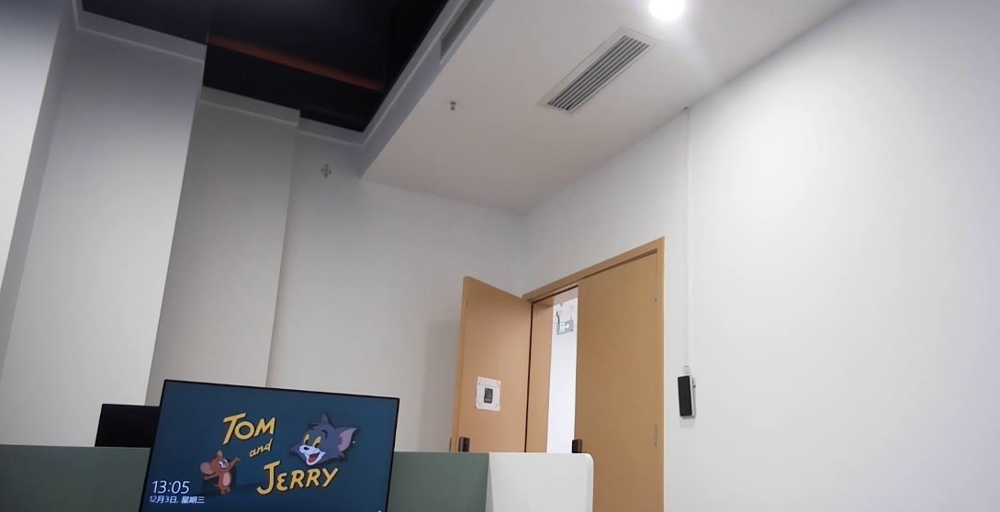
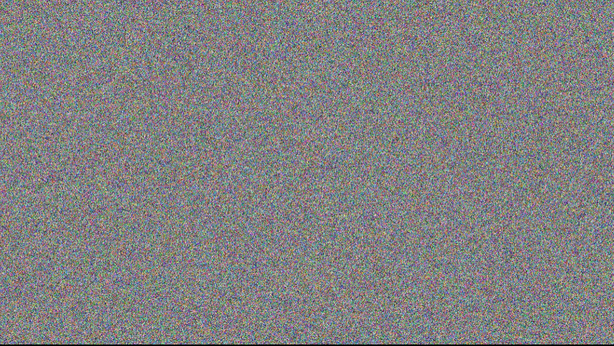

## 🔒 视频加密效果展示 (Demo)

本项目使用多维混沌算法对视频流进行加密。以下是 **原始视频** 与 **加密视频** 的关键片段对比。

  
  

  <b>原始视频 (Original Video)</b>
  &nbsp;&nbsp;&nbsp;&nbsp;&nbsp;&nbsp;&nbsp;&nbsp;&nbsp;&nbsp;&nbsp;&nbsp;&nbsp;&nbsp;&nbsp;&nbsp;&nbsp;&nbsp;
  <b>加密视频 (Encrypted Video)</b>

 

---

### 📂 演示文件位置说明

* **原始视频文件:** `test/cap_video.avi` (未推送到 Git 仓库，仅供本地测试参考)
* **加密视频文件:** `output/output_encryption.avi` (未推送到 Git 仓库，仅供本地测试参考)
